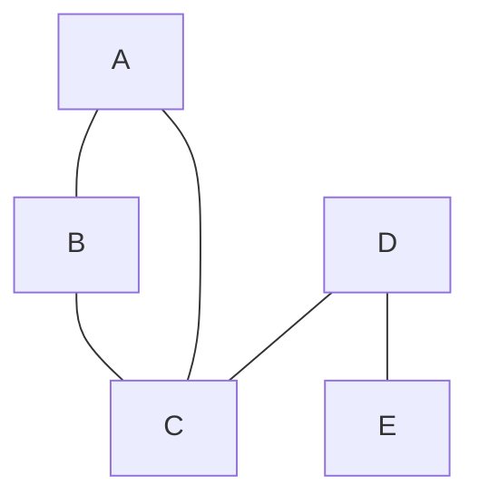
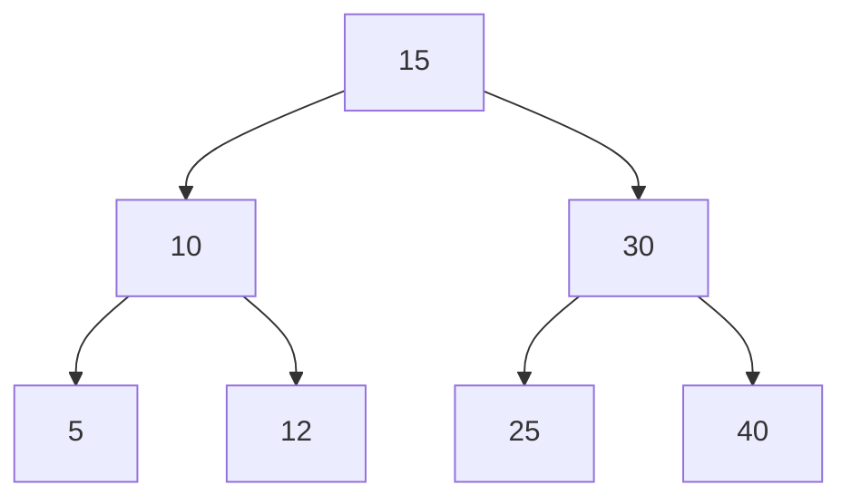
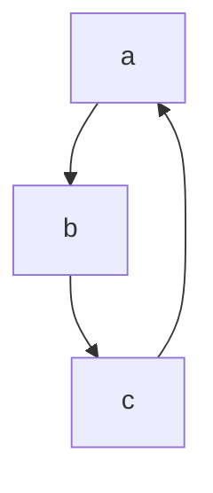

# Руководство

**Внимательно** ознакомтесь с данным руководством.

## Комплект поставки

- Устройство 1 шт.
- Чехол 1 шт.
- Соединительные провода 5 шт.

## Технические характеристики

Компьютер — функциональное устройство, способное выполнять значительный объём вычислений, включая многочисленные арифметические и логические операции, без вмешательства человека.

Компьютер может быть как отдельным блоком, так и состоять из нескольких взаимосвязанных устройств.

Первая строка (в конце два пробела)  
Вторая строка \
Третья строка

Первая часть до линии

---

Вторая часть.

---

И последняя часть

# Заголовок 1 уровня

Обычный текст

## Заголовок 2 уровня

Обычный текст

### Заголовок 3 уровня

Обычный текст

#### Заголовок 4 уровня

Обычный текст

##### Заголовок 5 уровня

Обычный текст

###### Заголовок 6 уровня

Обычный текст

# Заголовок 1 уровня

### Заголовок 3 уровня

###### Заголовок 6 уровня

# Заголовок первого уровня

Обычный текст

Заголовок второго уровня

---

Обычный текст

Обычный текст, а дальше _курсивный текст_. Или _вот так_.
Обычный текст, а дальше **полужирный текст**. Или **вот так**.
Обычный текст. А теперь **_полужирный и курсивный_**. Или **_вот так_**.
Обычный текст. А это ~~зачёркнутый текст~~.

Изучать markdown ~~неинтересно~~.

В этом тексте есть ==очень важные слова==. А дальше обычный текст.

Текст в языке markdown можно делать _курсивным_ или **полужирным**, а еще можно ~~зачеркивать~~ и ==выделять маркером==.

Текст \* со \*\*звёздочками\*\*.

Поищите это с помощью <https://www.google.ru>

Поищите это с помощью [гугл](https://www.google.ru)

На [степике](https://stepik.org/catalog "Российская платформа онлайн-образования") можно найти множество платных и бесплатных курсов.

Платформа для онлайн-обучения [Stepik.org][st] была основана в 2013 году. Сейчас на [степике][st] можно найти множество платных и бесплатных курсов.

[st]: https://stepik.org/catalog "Российская платформа онлайн-образования"

Чтобы перейти на Stepik, нажмите [здесь](https://stepik.org/catalog).

Логотип Markdown выглядит так:


Логотип Markdown выглядит так:
![логотип markdown][logo]

[logo]: https://miro.medium.com/v2/resize:fit:1400/1*eZ7YPTqzcyFVoQxIOIQ9kQ.png

Вот так выглядит логотип языка Golang:
![Golang logo][gopher]

[gopher]: https://encrypted-tbn0.gstatic.com/images?q=tbn:ANd9GcT7myRXjVMXOjYbh4hZCEA0yPWdnk8xYc9_dTvjR6I&s "Gopher - это суслик такой"

- Первый пункт
- Второй пункт

* Третий пункт

* Первый пункт
* Второй пункт
* Третий пункт

1. Первый пункт
1. Второй пункт
1. Третий пункт

---

1. Первый пункт
2. Второй пункт
3. Третий пункт

4. Первый пункт
5. Второй пункт
6. Третий пункт

---

123. Первый пункт
124. Второй пункт
125. Третий пункт

[x] Задача 1

- [x] Задача 2
- [ ] Задача 3
- [ ] задача 4

Здесь для создания подсписков нужно 2 или больше пробелов:

- Пункт 1
  - Подпункт 1
  - Подпункт 2
- Пункт 2
- Пункт 3

| Язык программирования | Год создания |
| --------------------- | ------------ |
| С++                   | 1983         |
| Python                | 1991         |
| Golang                | 2009         |

| Язык программирования | Год создания |
| :-------------------: | -----------: |
|          С++          |         1983 |
|        Python         |         1991 |
|        Golang         |         2009 |

| столбец1 | столбец 2 | столбец3 |
| -------: | :-------- | :------: |
|     test | test      |   test   |

| Модель           |  Цена  |
| :--------------- | :----: |
| realme 9 pro     | 19999  |
| galaxy A54       | 35000  |
| galaxy S23 ultra | 105999 |

Здесь обычный текст. А далее будет цитата:

> Имейте храбрость следовать своему сердцу и интуиции. Они каким-то образом уже знают то, кем вы хотите стать на самом деле.
>
> _Стив Джобс_

Здесь обычный текст. А далее будет сложная цитата:

> Начало основной цитаты.
>
> > Вложенная цитата.
> >
> > > Цитата третьего уровня вложенности.
>
> Продолжение основной цитаты.
>
> А здесь тоже обычный текст.

Здесь обычный текст с примечаниями [^1]. И ещё сноска[^2]

[^1]: Примечание один
[^2]: Примечание два
[^3]: Примечание три

Один из создателей языка Golang является Кен Томпсон[^1].

[^1]: Он также является разработчиком языка С

Объявляем константу `const PI = 3.14` и выводим её значение в консоль `console.log(PI);`.

Создаём переменную `let a = 5`, возводим её в квадрат `a *= a` и выводим в консоль `console.log(a);`.

Данная программа на Javascript выводит сумму двух переменных в консоль:

    let a = 12;
    let b = 9;
    console.log(a + b);

Тоже самое можно оформить так:

```
let a = 12;
let b = 9;
console.log(a + b);
```

И дальше снова обычный текст.

Данная программа на Javascript выводит сумму двух переменных в консоль:

```javascript
let a = 12;
let b = 9;
console.log(a + b);
```

Та же программа на Python выглядит так:

```python
a = 12
b = 9
print(a + b)
```

А на Golang вот так:

```go
package main
import  "fmt"
func  main() {
  a := 12
  b :=  9
  fmt.Println(a + b)
}
```

```
console.log(2 * 3)
```

Формула воды H~2~O

Формула серной кислоты H~2~SO~4~

2^10^ = 1024

(a+b)^2^=a^2^+2ab+b^2^

Напишите мне :email:

---

Кошка :cat: и мышка :mouse:

Чтобы открыть :lock:, тебе нужен :key:

I :heart: you!

Граф



Двоичное дерево поиска





Вставка прямо в текст $LaTeX here$
Вставка отдельным блоком $$LaTeX here$$

Формулы в тексте $\sin^2 \alpha + \cos^2 \beta = 1$ И ещё формула $k \ne \sqrt{x^2 + y^2}$ Можно вставлять и обыкновенные дроби $\dfrac{6 + 2x}{2x} = \dfrac{3 + x}{x}$ и опять текст.

Для того, чтобы найти сумму ряда
$$\sum_{n=1}^\infty \dfrac{2 \cdot 3^n + 4^n}{6^n}$$
нужно представить его в виде суммы двух рядов:
$$\sum_{n=1}^\infty \left( \dfrac{1}{2} \right)^n + \sum_{n=1}^\infty \left( \dfrac{2}{3} \right)^n$$

Пример определённого интеграла:
$$\int_0^{\sqrt{3}} \dfrac{xdx}{\sqrt{x^4 + 16}}$$
